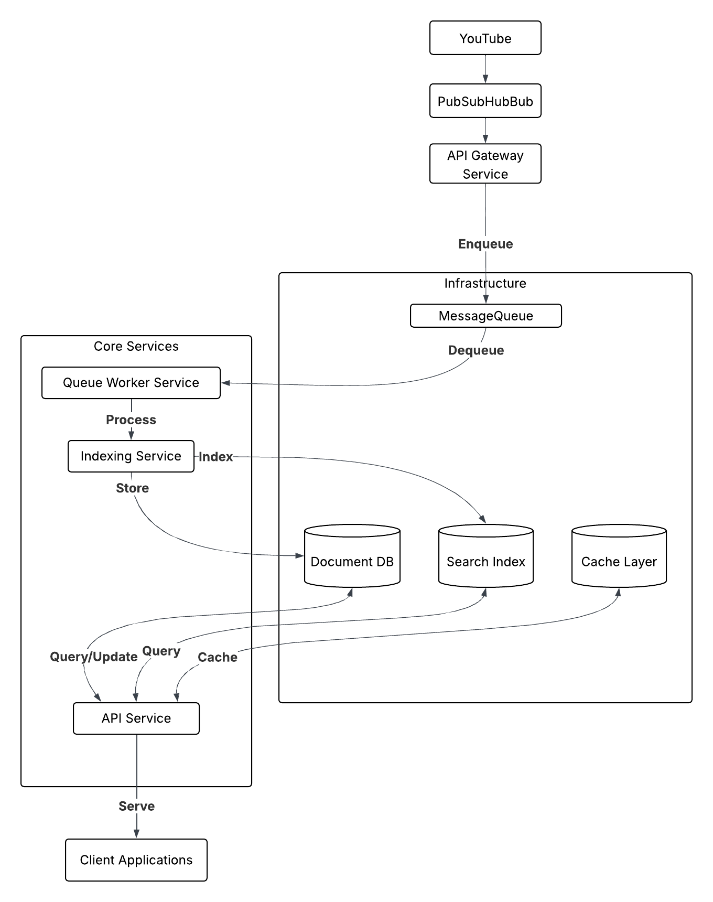

# YouTube PubSubHubbub Indexer Architecture

This document outlines the architecture for the YouTube PubSubHubbub indexer system, which processes YouTube content notifications, indexes them, and makes them searchable through an API.

## System Overview

The system follows an event-driven microservices architecture, designed to efficiently receive, process, and index YouTube content notifications. The architecture emphasizes scalability, fault tolerance, and separation of concerns.

## Diagram

## Documentation

[REF](assets/ARCHITECTURE.md)
