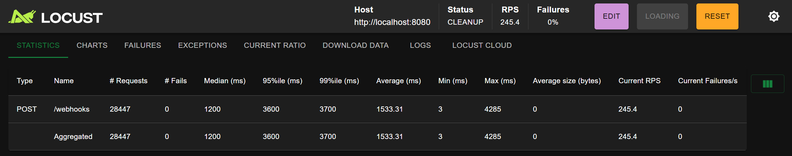

# YouTube PubSubHubbub Indexer Architecture

This document outlines the architecture for the YouTube PubSubHubbub indexer system, which processes YouTube content notifications, indexes them, and makes them searchable through an API.

## System Overview

The system follows an event-driven architecture, designed to efficiently receive, process, and index YouTube content notifications. The architecture emphasizes scalability, fault tolerance, and separation of concerns.

## Diagram

## Components

### 1. API Gateway Service

This service is responsible for receiving YouTube PubSubHubbub notifications and managing API requests.

**Key Features:**
- Handles webhook verification for PubSubHubbub subscriptions
- Processes incoming notifications and places them in a queue
- Provides a RESTful API for searching and retrieving indexed videos
- Implements rate limiting and trusted host validation
- Exposes statistics and monitoring endpoints

**Technologies:**
- FastAPI framework
- SlowAPI for rate limiting
- Valkey/Redis for queue management

### 2. Queue Worker Service

This service processes notifications from the queue and extracts metadata from YouTube updates.

**Key Features:**
- Dequeues notifications from the message queue
- Parses XML notification data to extract video and channel information
- Performs initial processing and validation
- Forwards enriched metadata to the Indexing Service queue

**Technologies:**
- Asynchronous processing with Python's asyncio
- XML parsing
- Valkey/Redis for queue interaction

### 3. Indexing Service

This service is responsible for storing and indexing video metadata.

**Key Features:**
- Stores video metadata in MongoDB
- Creates and maintains search indices in Elasticsearch
- Updates channel statistics based on video notifications
- Provides data enrichment capabilities

**Technologies:**
- MongoDB for document storage
- Elasticsearch for full-text search capabilities
- Asynchronous processing with Motor and AsyncElasticsearch

### 4. Data Storage Layer

The system uses multiple data stores for different purposes:

**MongoDB:**
- Primary document store
- Stores video and channel metadata
- Supports complex queries and aggregations

**Elasticsearch:**
- Full-text search capabilities
- Fast querying for video content
- Advanced filtering and sorting

**Valkey/Redis:**
- Message queues between services
- Rate limiting data
- Optional caching layer

## Communication Flow

1. YouTube sends a PubSubHubbub notification to the API Gateway
2. API Gateway validates and enqueues the notification
3. Queue Worker dequeues and processes notifications
4. Queue Worker extracts metadata and sends to Indexing Service
5. Indexing Service stores data in MongoDB and indexes in Elasticsearch
6. API clients can query the API Gateway to search and retrieve indexed content

## Scaling Considerations

Each service can be independently scaled:
- API Gateway: Scale to handle increased webhook and API traffic
- Queue Worker: Scale to process more notifications simultaneously
- Indexing Service: Scale to handle higher indexing throughput
- Data Stores: Deploy as clusters when needed for higher loads

## Load Test Analysis

### Test Environment
- **Processor:** AMD Ryzen 7 5700X (8 cores @ 3.40 GHz)
- **Memory:** 32 GB DDR4 @ 3600 MHz
- **OS:** Windows 11 Pro using WSL2 (Ubuntu 24.04.2 LTS)
- **Tool:** Locust

---

### Results Overview

**Performance Metrics:**
- Target Endpoint: `/webhooks` (POST)
- Total Requests: 28,447
- Failures: **0%** (Excellent stability)
- Requests Per Second (RPS): Peaks at **245.4 RPS**

**Request Latency:**

| Metric          | Value (ms) |
|-----------------|-------------|
| Median          | 1200        |
| 95th Percentile | 3600        |
| 99th Percentile | 3700        |
| Average         | 1533        |
| Max             | 4285        |
| Min             | 3           |

> The **median response time of 1200ms** and a **95th percentile at 3600ms** indicate the server is responsive at lower loads but starts struggling under peak conditions.

---

**Requests per Second:**
- Gradual ramp-up to **~230-250 RPS**.
- No failures observed during the run (Failure/s = 0).

**Response Times:**
- As load increases:
    - **50th percentile rises from ~300ms to 1000ms.**
    - **95th percentile peaks around 1600ms to 3700ms.**
- Clear correlation between user increase and response time degradation.

**Users:**
- Test scaled up to around **680 concurrent users**.
- At this level, the RPS stabilized with no failures, but latency rose significantly.

---

### Interpretation

- Your service handles **up to ~230-250 RPS with 680 users without errors**, which is solid.
- **Latency scaling is the key bottleneck:**
  - Median creeping above 1000ms under load.
  - 95th/99th percentiles reaching beyond 3 seconds indicates stress on the server.

---

### Potential Bottlenecks

- I/O-bound operations (Database, Network, File writes).
- Thread contention or locking.
- WSL2 limitations (not a full Linux kernel, potential networking overhead).
- CPU-bound processing spikes due to synchronous tasks.