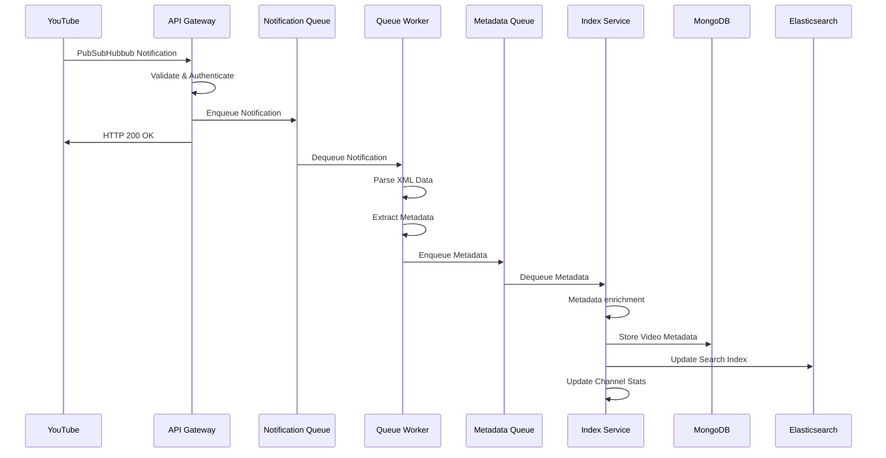

## Data Flow Architecture

The system processes data through a series of well-defined stages:

### Processing Stages

1. **Notification Receipt**: YouTube sends PubSubHubbub notifications to the API Gateway
2. **Validation**: The gateway validates the notification signature and source
3. **Queuing**: Valid notifications are queued for asynchronous processing
4. **Extraction**: The Queue Worker parses XML and extracts video metadata
5. **Enrichment**: Additional processing and data validation occurs
6. **Storage**: The Indexing Service persists data to MongoDB
7. **Indexing**: Video metadata is indexed in Elasticsearch for search
8. **Statistics**: Channel-level statistics are updated