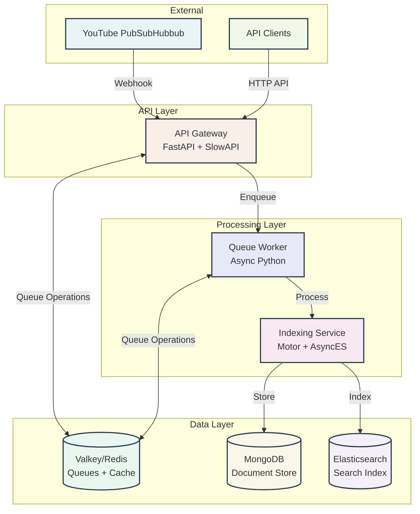

# System Architecture Overview

The YouTube Video Indexer follows an event-driven, microservices architecture designed for high scalability, fault tolerance, and maintainability. This document provides a comprehensive overview of the system's design principles and architectural decisions.

## Design Principles

### Event-Driven Architecture
The system is built around asynchronous message passing, allowing services to operate independently while maintaining loose coupling. This approach provides several benefits:

- **Scalability**: Each service can be scaled independently based on demand
- **Resilience**: Failures in one service don't cascade to others
- **Flexibility**: New services can be added without modifying existing ones
- **Performance**: Non-blocking operations maximize throughput

### Separation of Concerns
Each service has a single, well-defined responsibility:

- **API Gateway**: HTTP interface and request routing
- **Queue Worker**: Message processing and data extraction
- **Indexing Service**: Data persistence and search indexing

### Fault Tolerance
The system implements multiple layers of fault tolerance:

- **Queue-based Processing**: Messages persist even if services are temporarily unavailable
- **Retry Logic**: Failed operations are automatically retried with exponential backoff
- **Circuit Breakers**: Prevent cascading failures by temporarily disabling unhealthy dependencies
- **Health Checks**: Monitor service availability and trigger alerts

## High-Level Architecture

