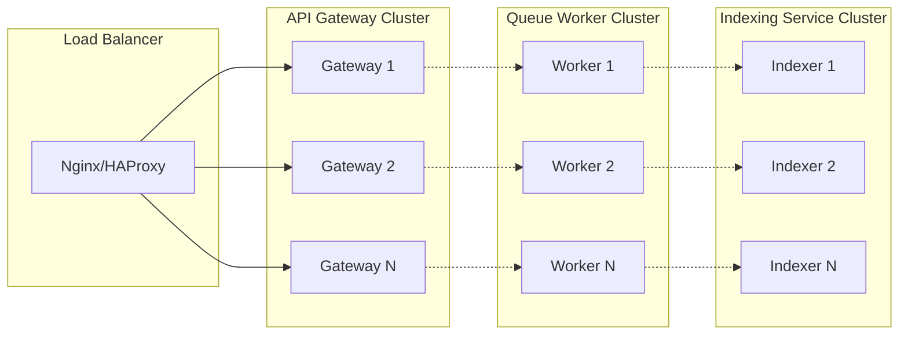

## Scalability Design

### Horizontal Scaling
Each service can be scaled independently:

### Performance Characteristics

Based on recent benchmarking:

- **API Gateway**: Handles 245+ RPS with median 1.2s latency
- **Queue Worker**: Processes thousands of messages per minute
- **Indexing Service**: Maintains search indices for millions of documents

### Scaling Strategies

**API Gateway Scaling**:

- Add more instances behind a load balancer
- Optimize for I/O-bound webhook processing
- Scale based on HTTP request volume

**Queue Worker Scaling**:

- Increase worker instances to handle queue backlog
- Monitor queue depth and processing time
- Scale based on notification volume

**Indexing Service Scaling**:

- Scale for write-heavy workloads to MongoDB and Elasticsearch
- Batch operations for improved throughput
- Scale based on indexing latency and volume
