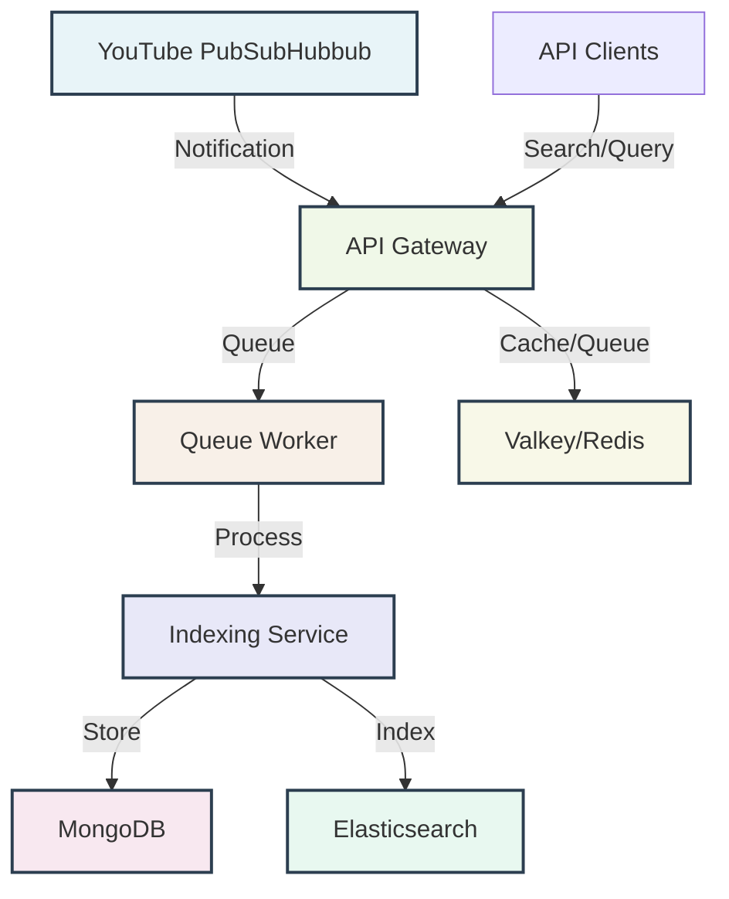

# YouTube Video Indexer

A high-performance, event-driven system for indexing YouTube content through PubSubHubbub notifications. Built with Python, FastAPI, and modern async patterns for scalable video metadata processing and search.

## Overview

The YouTube Video Indexer is designed to efficiently receive, process, and index YouTube video content in real-time. The system follows an event-driven architecture that emphasizes scalability, fault tolerance, and separation of concerns.

### Key Features

- **Real-time Processing**: Handles YouTube PubSubHubbub notifications as they arrive
- **Scalable Architecture**: Microservices design allowing independent scaling of components
- **Full-text Search**: Elasticsearch integration for fast content discovery
- **Fault Tolerant**: Queue-based processing with automatic retry mechanisms
- **API-First**: RESTful API for integration with external systems

### Use Cases

- **Content Monitoring**: Track channel updates and video publications and indexing thein content
- **Analytics Platform**: Build dashboards around YouTube content trends
- **Search Engine**: Create searchable indexes of video metadata
- **RAG System**: Retrieval augmented systems

## Architecture

The system consists of three main services working together:

### Services

1. **API Gateway**: Handles webhook verification, API requests, and rate limiting
2. **Queue Worker**: Processes notifications and extracts metadata
3. **Indexing Service**: Stores data in MongoDB and maintains Elasticsearch indices

### Data Stores

- **MongoDB**: Primary document store for video and channel metadata
- **Elasticsearch**: Full-text search and advanced filtering capabilities
- **Valkey/Redis**: Message queues, rate limiting, and caching

See the [installation guide](getting-started/installation.md) and 
[quick-start](getting-started/quick-start.md)

## 🛠️ Technology Stack

### Backend
- **FastAPI**: Modern, fast web framework for building APIs
- **Python**: Async/await patterns for high-performance I/O
- **SlowAPI**: Rate limiting and request throttling

### Data Layer
- **MongoDB**: Document storage with Motor async driver
- **Elasticsearch**: Search engine with AsyncElasticsearch client
- **Valkey/Redis**: Queue management and caching

### Infrastructure
- **Docker**: Containerization for consistent deployments
- **Docker Compose**: Multi-service orchestration
- **Nginx**: Reverse proxy and load balancing (optional)

## License

This project is licensed under the MIT License. See the LICENSE file for details.

## Links

- [GitHub Repository](https://github.com/maikereis/youtube-video-indexer)
- [Issue Tracker](https://github.com/maikereis/youtube-video-indexer/issues)
- [Discussions](https://github.com/maikereis/youtube-video-indexer/discussions)